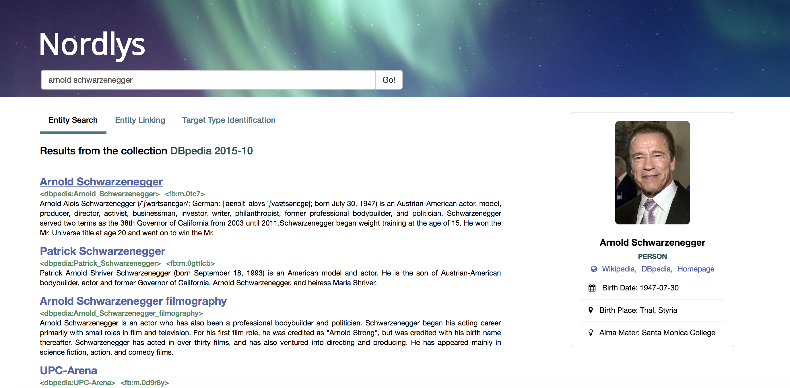
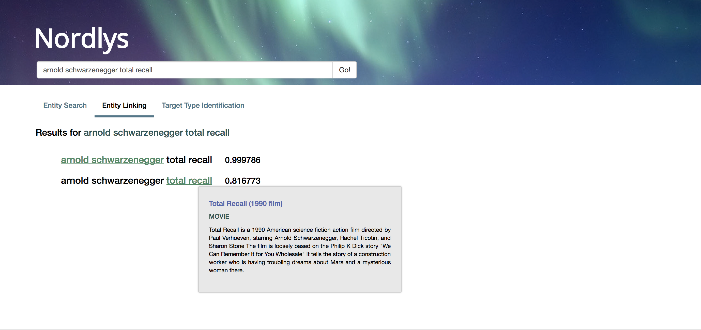
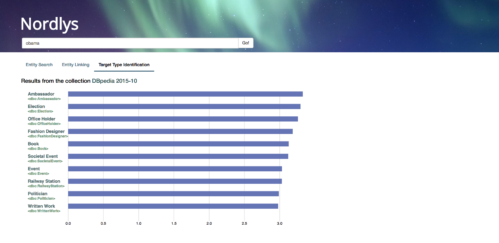

Web interface
=============

Nordlys is shipped with a web interface, which is built on the `Nordlys API <http://api.nordlys.cc/>`_. It is a wrapper for all functionalities provided by Nordlys toolkit and can be used, e.g., to perform user studies on result presentation.

The implementation of Web interface is based on Flask and Bootstrap. Below we describe the functionalities provided by the excerpts from the Web interface with their  interface.  

.. note:: The interface can be accessed via: http://gui.nordlys.cc/

Entity search
~~~~~~~~~~~~~

The entity search tab provides a ranked list of entities entities in response to an entity-bearing query. We generate the results by calling Entity retrieval service of our API; e.g. ::

 http://api.nordlys.cc/er?q=total+recall&model=lm&1st_num_docs=100&fields_return=abstract

By clicking on each result, we present an entity card, containing the factual summary of the entity and an image. We use the entity catalog (EC) service to generate these cards.

   Nordlys Web interface - Entity Search

   
Entity linking in queries
~~~~~~~~~~~~~~~~~~~~~~~~~

For entity linking in queries, we use the baseline CMNS method, with threshold 0.1. 
For example, we make the following call to the entity linking service of our API::

 http://api.nordlys.cc/el?q=arnold+schwarzenegger+total+recall&method=cmns&threshold=0.1

   Nordlys Web interface - Entity Linking

Target Type Identification
~~~~~~~~~~~~~~~~~~~~~~~~~~

For target type identification, we employ the type centric method; e.g.::

  http://api.nordlys.cc/tti?q=obama

   Nordlys Web interface - Target Type Identification

.. note:: For detailed information about out API calls see :doc:`api_usage`
