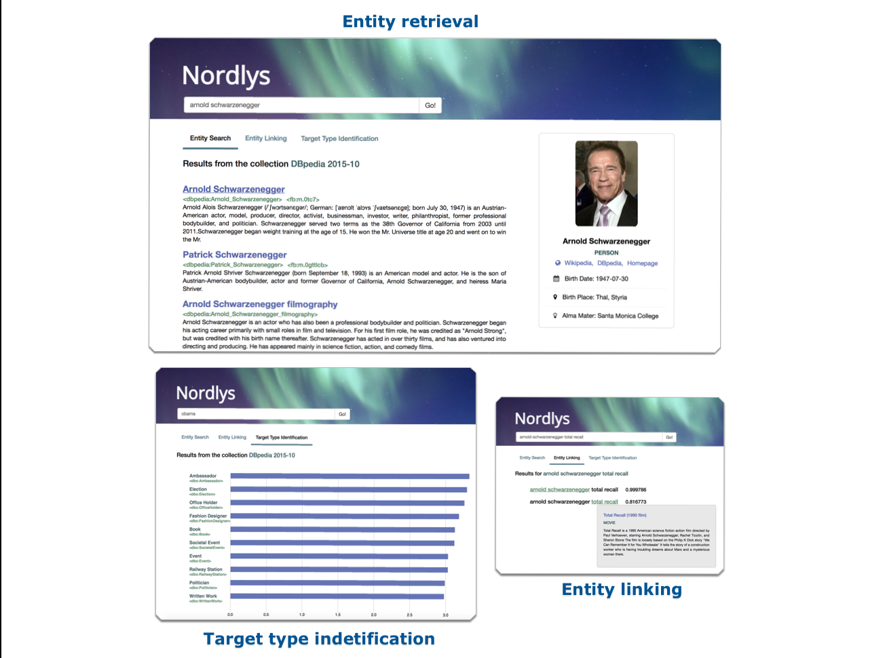

What is Nordlys?
================

Nordlys is a toolkit for entity-oriented and semantic search.
Entities (such as people, organizations, or products) are natural units of current web search engines, and are extracted from Knowledge bases like `DBpedia <http://wiki.dbpedia.org/>`_.

Nordlys supports 3 functionalities in the context of entity-oriented search:

- **Entity retrieval**: Returns a ranked list of entities in response to an entity-bearing query
- **Entity linking**: Identifies entities in queries and links them to the corresponding entry in the Knowledge base
- **Target type identification**:  Detects the target types (or categories) of queries

Below, we illustrate what each of these functionalities mean.

Nordlys can be used ...
~~~~~~~~~~~~~~~~~~~~~~~

- through a :doc:`web-based GUI <web_gui>`
- through a :doc:`RESTful API <restful_api>`
- as a :doc:`command line tool <cmd_usage>`
- as a :doc:`Python package <api/nordlys>`

Components
~~~~~~~~~~~~~

- Core components
   - :doc:`Retrieval <retrieval_pkg>`
   - :doc:`Machine learning <api/nordlys.core.ml>`
- Entity-oriented components
   - :doc:`Entity retrieval <er>`
   - :doc:`Entity linking <el>`
   - :doc:`Entity catalog <ec>`
   - :doc:`Target type identification <tti>`

